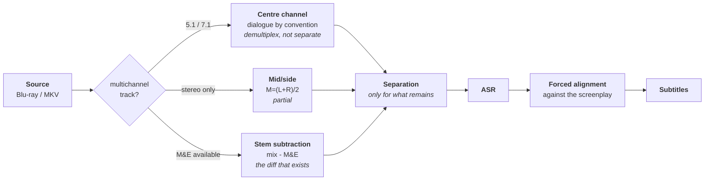

# Diegesis

**Pull the voices out of the film.** Separating dialogue from music and effects in cinematic audio, for accurate subtitles, dubbing prep and dialogue-only analysis. The interesting part is how much of it is not a separation problem at all.


---

## The name

In film sound theory, **diegetic** sound belongs to the story world — dialogue, footsteps, an on-screen radio. **Non-diegetic** sound does not — the score, a voice-over narrator. That distinction is exactly the separation performed here, and it is the vocabulary the people who mix these films already use.

## What it does

Film audio arrives as a finished mix: dialogue, score, foley and effects fused into one signal. Automatic transcription on that mix is unreliable, and it fails in a particularly annoying way — music and effects are loudest exactly when the dialogue matters most, because dramatic scenes are mixed loud. Word error rate degrades precisely where accuracy is needed.

The goal is a clean dialogue track, and from it a highly accurate transcript.

## Why it is not a subtraction

The intuitive question — *why not just diff the mix against the music?* — has a specific answer, and understanding it is what reveals where the real leverage sits.

| # | Obstacle | Consequence |
|---|---|---|
| 1 | **Both operands are never available** | `diff` recovers B from A and A+B. A finished mix provides only the sum. |
| 2 | **The problem is underdetermined** | One equation, two unknowns per time–frequency bin. Voice and music occupy the same bins simultaneously; no arithmetic un-sums one number into two. |
| 3 | **The mix is not linear addition** | Bus compression, limiting and dialogue ducking mean `mix ≠ music + dialogue`. It is `f(music, dialogue)`, signal-dependent and time-varying. A lossy codec then discards masked content permanently. |
| 4 | **Phase is unforgiving** | Even with the correct stem, sub-sample misalignment turns cancellation into comb filtering. |

Separation must therefore *infer*, using learned priors about what speech and music look like. That is why the field trains models rather than writing filters.

## But the intuition is right — three times over

Film audio is not arbitrary. It is mixed to conventions, and conventions are exploitable.



| Shortcut | What it gives | Cost |
|---|---|---|
| **Centre channel** | In 5.1/7.1, dialogue is mixed almost exclusively to centre. Take channel 3. | free |
| **Mid/side** | `M=(L+R)/2` isolates centre-panned content in stereo. Partial. | free |
| **M&E stems** | Films ship Music & Effects tracks for dubbing. `mix − M&E` = dialogue. | needs access |

**The centre channel is the headline.** It is not separation at all — it is demultiplexing, and it beats any neural model at zero cost with zero artefacts. Any pipeline that downmixes to stereo before separating has discarded the answer before starting.

```bash
# inspect before assuming — many MKVs carry several tracks
ffprobe -v error -select_streams a \
  -show_entries stream=index,codec_name,channels,channel_layout \
  -of default=noprint_wrappers=1 movie.mkv

# extract the centre channel (5.1 order: L R C LFE Ls Rs)
ffmpeg -i movie.mkv -filter_complex "[0:a]pan=mono|c0=c2[out]" \
  -map "[out]" -c:a pcm_s24le center.wav
```

A stereo downmix folds centre into L and R at roughly −3 dB, unrecoverably. Checking for a true multichannel stream is the first step, not an optimisation.

## The reframe

For subtitles specifically, separation may not be the shortest path at all.

When a screenplay or existing subtitle file is available, the task changes from *recognition* — open-vocabulary and error-prone — to *forced alignment*, where the text is known and only the timings are missing. Alignment is dramatically more accurate and far more robust to background noise.

```
5.1 source → centre channel → ASR → align against screenplay → subtitles
```

Separation becomes the fallback for unscripted material, not the mechanism.

---

## Status

**v0 — exploration.** Problem framed, data routes identified, no code yet.

The first experiment is deliberately the cheap one: **measure how reliably the centre-channel convention actually holds** across real films. A few titles and `ffmpeg`; no training, no GPU. Nobody appears to have published it, every other angle depends on the answer, and it produces the tooling the rest of the work needs anyway.

If dialogue is centre-locked 95% of the time, neural separation of the full mix is largely a problem to route around. If it is 60%, spatially-informed separation has real room.

## Where the research stands

Cinematic Audio Source Separation is an established subtask with the [Divide and Remaster dataset](https://arxiv.org/abs/2407.07275) and a [2023 Sound Demixing Challenge track](https://arxiv.org/pdf/2308.06981). This is a benchmark to beat, not open ground — which is useful, because it means baselines, metrics and a community exist.

The obvious angle — *separation artefacts hurt ASR, so optimise for word error rate rather than signal distortion* — is already occupied and should be reproduced as a baseline rather than claimed.

## Documentation

| Doc | Contents |
|---|---|
| [00-problem.md](docs/00-problem.md) | Why subtraction fails, and the structural shortcuts that work |
| [01-data.md](docs/01-data.md) | Legal sources for multichannel audio, volume required, extraction |

Research materials — novelty analysis and experiment designs — are kept local and are not published here.

## Related

- **Sluglint** — screenplay linter. Directly relevant: the strongest subtitle route aligns against a known screenplay, and Sluglint already parses those.
- **VoiceForge** — character-aware voice conditioning. Clean extracted film dialogue is the reference material its evaluation benchmark needs.

## Licence

Undecided. PolyForm Noncommercial, matching the sibling projects, is the likely default.
